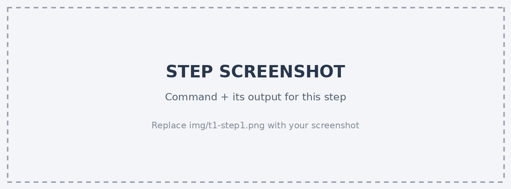
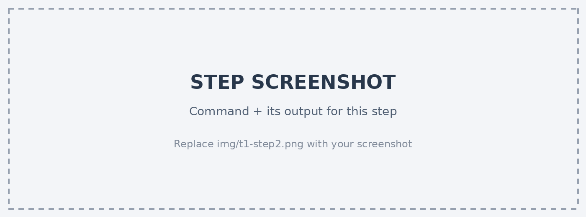
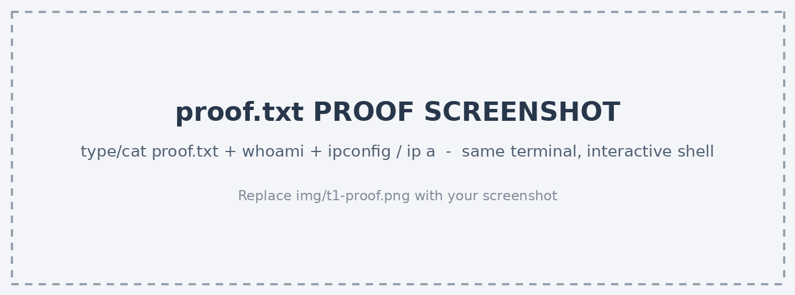
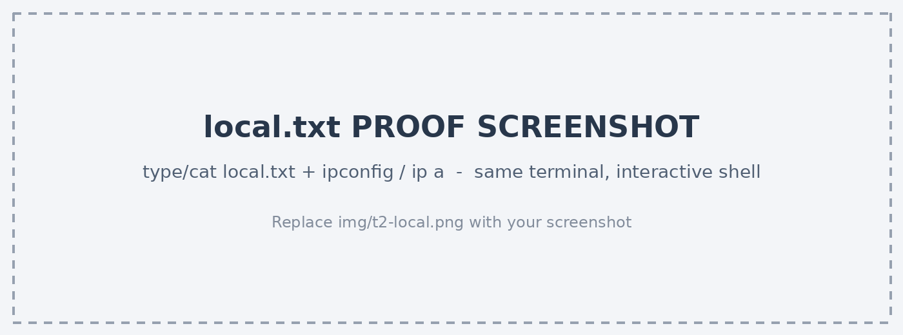
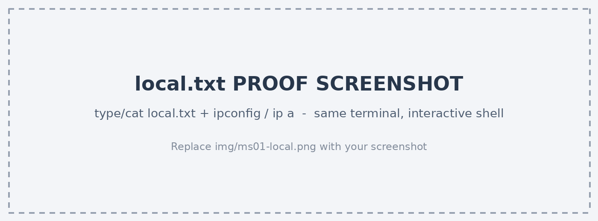
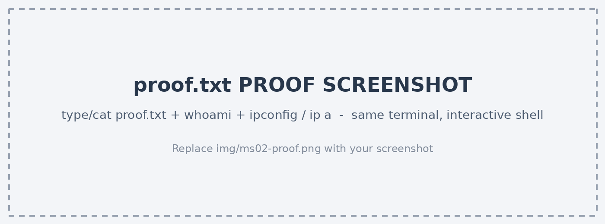

<!--
HOW TO USE THIS TEMPLATE
- Compatible with noraj/OSCP-Exam-Report-Template-Markdown (pandoc + Eisvogel) and
  easy to paste into SysReptor. HTML comments like this one are dropped from the PDF.
- Replace every [placeholder]. Delete any section you did not reach (e.g. a privesc you did not get).
- Write in English. Do not use any AI tool while writing the report (banned by OffSec).
- Every proof.txt / local.txt screenshot MUST show the flag AND the IP address
  (ipconfig / ip a / ifconfig) in the SAME terminal, from an interactive shell (not a web shell).
- Document every step so that a reader can reproduce it: commands, console output, screenshots.
- Final file: OSCP-OS-XXXXX-Exam-Report.pdf inside OSCP-OS-XXXXX-Exam-Report.7z (no password).
-->

# OffSec OSCP+ Exam Report

## Introduction

This report documents all efforts conducted by [Full Name] during the OffSec Certified Professional (OSCP+) exam. It contains every item used to complete the exam and is intended to demonstrate a full understanding of penetration testing methodology and the technical knowledge required for the OSCP+ certification.

## Objective

The objective of this assessment was to perform an internal penetration test against the OffSec exam network, following a methodical approach from information gathering through exploitation, privilege escalation and post-exploitation, and to document the findings in a professional report.

## Requirements

This report contains the following sections:

- High-Level Summary and Recommendations (non-technical)
- Methodology walkthrough and a detailed outline of the steps taken
- Each finding with screenshots, a walkthrough, proof-of-concept code, and the contents of `local.txt` / `proof.txt`
- Any additional items not covered elsewhere

\newpage

# High-Level Summary

[Full Name] was tasked with performing an internal penetration test against the OffSec exam network. The test consisted of three standalone machines and one Active Directory set of three machines. For the Active Directory set, the test started from the credentials of a standard domain user provided by OffSec (assumed breach scenario).

During the assessment, [Full Name] gained access to [X] of the [6] in-scope machines and obtained administrative/root-level access on [X] of them. The main causes of compromise were [e.g. outdated software, weak or reused credentials, insecure service configurations, excessive Active Directory permissions].

## Compromised Systems

| Target | Hostname | IP Address | Initial Access | Privilege Escalation | local.txt | proof.txt |
|---|---|---|---|---|---|---|
| Standalone 1 | [HOSTNAME] | [10.x.x.x] | [Vulnerability] | [Vulnerability] | Yes / No | Yes / No |
| Standalone 2 | [HOSTNAME] | [10.x.x.x] | [Vulnerability] | [Vulnerability] | Yes / No | Yes / No |
| Standalone 3 | [HOSTNAME] | [10.x.x.x] | [Vulnerability] | [Vulnerability] | Yes / No | Yes / No |
| AD - MS01 | [HOSTNAME] | [10.x.x.x] | [Vulnerability] | [Vulnerability] | Yes / No | Yes / No |
| AD - MS02 | [HOSTNAME] | [10.x.x.x] | [Vulnerability] | [Vulnerability] | Yes / No | Yes / No |
| AD - DC01 | [HOSTNAME] | [10.x.x.x] | [Vulnerability] | [Vulnerability] | Yes / No | Yes / No |

**Metasploit / Meterpreter usage:** [None] / [Used only against: HOSTNAME - 10.x.x.x]

## Recommendations

[Full Name] recommends remediating the vulnerabilities identified in this report so that an attacker cannot exploit these systems in the future. In particular:

- [Apply vendor patches for the outdated software identified on HOSTNAME.]
- [Enforce a strong password policy and stop credential reuse between local and domain accounts.]
- [Review Active Directory permissions (ACLs, service accounts, Kerberos pre-authentication settings).]

These systems should be placed on a regular patch management program so that newly discovered vulnerabilities are addressed promptly.

\newpage

# Methodology

[Full Name] used a widely adopted penetration testing approach to assess the security of the exam environment. The phases below summarise this approach; the individual findings for each machine are detailed in the following chapters.

## Information Gathering

The scope of the test was limited to the following IP addresses:

**Standalone Machines:** [10.x.x.x], [10.x.x.x], [10.x.x.x]

**Active Directory Set:** [10.x.x.x], [10.x.x.x], [10.x.x.x]

**Provided Credentials (AD Set):** `[domain\username]` / `[password]`

## Service Enumeration

Service enumeration focused on identifying the services exposed by each system to determine potential attack vectors. A full TCP port scan and a UDP scan of common ports were performed against every target, followed by manual, service-specific enumeration.

## Penetration

This phase focused on gaining initial access to each system, escalating privileges to administrative/root level, and, within the Active Directory set, moving laterally until the domain controller was compromised.

## House Cleaning

After the objectives were completed, all files, user accounts and services created during testing were removed from the compromised systems. [List anything you created and removed, e.g. uploaded binaries in C:\Windows\Temp, added users.]

\newpage

# Independent Challenges

## Target #1 - [HOSTNAME] - [10.x.x.x]

### Service Enumeration

| IP Address | TCP Ports | UDP Ports |
|---|---|---|
| [10.x.x.x] | [22, 80, 445] | [161] |

```text
[Paste the relevant part of the nmap output]
```

[Describe the enumeration that led to the vulnerability, e.g. web directory brute forcing, SMB share listing, version identification.]

### Initial Access - [Vulnerability Name]

**Vulnerability Explanation:** [What the vulnerability is and why the service is affected.]

**Vulnerability Fix:** [Patch / configuration change / upgrade version.]

**Severity:** [Critical / High / Medium / Low]

**Steps to reproduce the attack:**

1. [Step description.]

    ```bash
    [command]
    ```

    

2. [Step description.]

    ```bash
    [command]
    ```

    

**Proof of Concept Code:** [Original exploit: URL / Exploit-DB ID. Describe every modification you made; include the modified code here or in the appendix.]

```python
[Modified exploit code - highlight or comment the changed lines]
```

**local.txt Proof Screenshot:**

<!-- Same terminal: `type local.txt` / `cat local.txt` + `ipconfig` / `ip a`. Interactive shell only. -->


**local.txt Contents:** `[flag]`

### Privilege Escalation - [Vulnerability Name]

**Vulnerability Explanation:** [Misconfiguration / vulnerable component and how it allows escalation.]

**Vulnerability Fix:** [Remediation.]

**Severity:** [Critical / High / Medium / Low]

**Steps to reproduce the attack:**

1. [Step description.]

    ```bash
    [command]
    ```

2. [Step description.]

    ```bash
    [command]
    ```

**Proof of Concept Code:** [If applicable.]

### Post-Exploitation

**proof.txt Proof Screenshot:**

<!-- Same terminal: `type proof.txt` / `cat proof.txt` + `ipconfig` / `ip a` + `whoami`. -->



**proof.txt Contents:** `[flag]`

\newpage

## Target #2 - [HOSTNAME] - [10.x.x.x]

### Service Enumeration

| IP Address | TCP Ports | UDP Ports |
|---|---|---|
| [10.x.x.x] | [ports] | [ports] |

```text
[nmap output]
```

### Initial Access - [Vulnerability Name]

**Vulnerability Explanation:**

**Vulnerability Fix:**

**Severity:**

**Steps to reproduce the attack:**

**Proof of Concept Code:**

**local.txt Proof Screenshot:**



**local.txt Contents:** `[flag]`

### Privilege Escalation - [Vulnerability Name]

**Vulnerability Explanation:**

**Vulnerability Fix:**

**Severity:**

**Steps to reproduce the attack:**

**Proof of Concept Code:**

### Post-Exploitation

**proof.txt Proof Screenshot:**


**proof.txt Contents:** `[flag]`

\newpage

## Target #3 - [HOSTNAME] - [10.x.x.x]

### Service Enumeration

| IP Address | TCP Ports | UDP Ports |
|---|---|---|
| [10.x.x.x] | [ports] | [ports] |

```text
[nmap output]
```

### Initial Access - [Vulnerability Name]

**Vulnerability Explanation:**

**Vulnerability Fix:**

**Severity:**

**Steps to reproduce the attack:**

**Proof of Concept Code:**

**local.txt Proof Screenshot:**


**local.txt Contents:** `[flag]`

### Privilege Escalation - [Vulnerability Name]

**Vulnerability Explanation:**

**Vulnerability Fix:**

**Severity:**

**Steps to reproduce the attack:**

**Proof of Concept Code:**

### Post-Exploitation

**proof.txt Proof Screenshot:**


**proof.txt Contents:** `[flag]`

\newpage

# Active Directory Set

## Overview

**Domain:** [domain.local]

**Provided Credentials:** `[domain\username]` / `[password]`

**Attack Path Summary:**

```text
[username] (provided)
   -> MS01 [10.x.x.x]  : [e.g. WinRM with provided creds -> local admin via X]
   -> creds looted     : [e.g. cached hash of svc_account via mimikatz]
   -> MS02 [10.x.x.x]  : [e.g. pass-the-hash as svc_account]
   -> DC01 [10.x.x.x]  : [e.g. Kerberoast / ACL abuse -> Domain Admin]
```

**Port Scan Results**

| IP Address | TCP Ports | UDP Ports |
|---|---|---|
| [10.x.x.x] (MS01) | [ports] | [ports] |
| [10.x.x.x] (MS02) | [ports] | [ports] |
| [10.x.x.x] (DC01) | [ports] | [ports] |

## Domain Enumeration

[Document the enumeration performed with the provided credentials: BloodHound collection, users/groups, SPNs, AS-REP roastable accounts, shares, user descriptions, etc. Include commands and key output.]

```bash
[command]
```

\newpage

## MS01 - [HOSTNAME] - [10.x.x.x]

### Initial Access - [Technique]

**Vulnerability Explanation:**

**Vulnerability Fix:**

**Severity:**

**Steps to reproduce the attack:**

**local.txt Proof Screenshot (if present):**



**local.txt Contents:** `[flag]`

### Privilege Escalation - [Technique]

**Vulnerability Explanation:**

**Vulnerability Fix:**

**Severity:**

**Steps to reproduce the attack:**

### Post-Exploitation

[Credentials, hashes or tickets collected on this machine that were used to move to the next target.]

**proof.txt Proof Screenshot:**


**proof.txt Contents:** `[flag]`

\newpage

## MS02 - [HOSTNAME] - [10.x.x.x]

### Lateral Movement - [Technique]

**Vulnerability Explanation:**

**Vulnerability Fix:**

**Severity:**

**Steps to reproduce the attack:**

**local.txt Proof Screenshot (if present):**


**local.txt Contents:** `[flag]`

### Privilege Escalation - [Technique]

**Vulnerability Explanation:**

**Vulnerability Fix:**

**Severity:**

**Steps to reproduce the attack:**

### Post-Exploitation

[Credentials, hashes or tickets collected on this machine.]

**proof.txt Proof Screenshot:**



**proof.txt Contents:** `[flag]`

\newpage

## DC01 - [HOSTNAME] - [10.x.x.x]

### Domain Compromise - [Technique]

**Vulnerability Explanation:**

**Vulnerability Fix:**

**Severity:**

**Steps to reproduce the attack:**

### Post-Exploitation

**proof.txt Proof Screenshot:**

<!-- Show `type C:\Users\Administrator\Desktop\proof.txt` + `ipconfig` + `whoami` in the same shell. -->


**proof.txt Contents:** `[flag]`

\newpage

# Additional Items Not Mentioned in the Report

[Anything relevant that does not fit above, e.g. attack paths that were attempted but failed. Delete this chapter if unused.]

# Appendix

## Appendix A - Modified Exploit Code

**Original exploit:** [URL / Exploit-DB ID]

**Changes made:** [Describe each change.]

```python
[Full modified exploit code]
```
